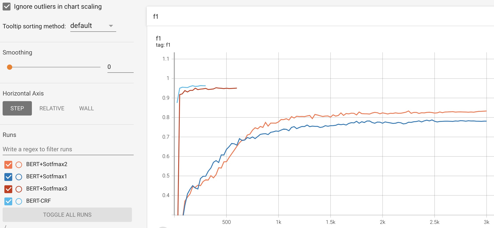
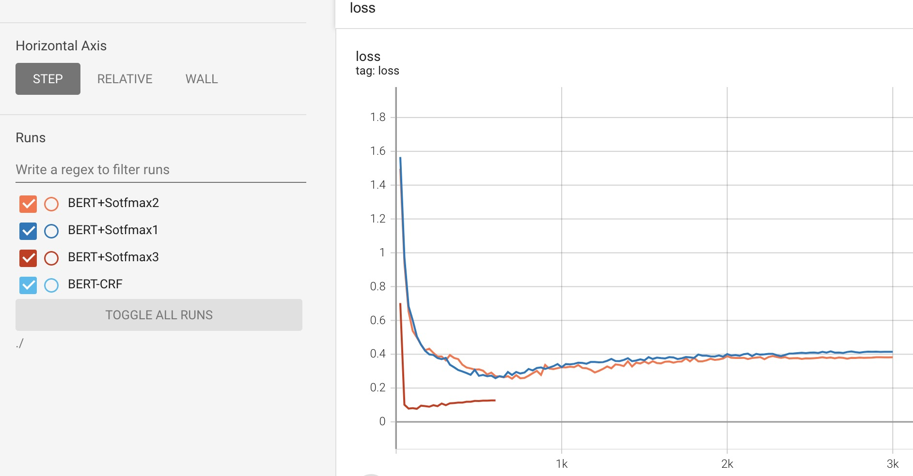

# 基于BERT的中文命名实体识别

## 项目简介
本项目使用BERT模型进行中文命名实体识别。主要工作如下：
- 使用pytorch自己从头实现BERT模型，并且基于Bert+Softmax模型，进行命名实体任务实践。
- 探索预训练任务对下游训练任务的影响，基于HuggingFace实现的BERT模型，分别使用预训练权重与随机权重进行模型权重初始化，并且使用BERT+Softmax进行NER任务对比实验。
- 探索CRF在NER任务中的有效性，并且进行BERT+CRF验证性实验,验证了CRF的有效性

### 数据集
本项目使用[Lattice LSTM](https://arxiv.org/pdf/1805.02023.pdf) 论文中的数据集，其中训练集3821条，验证集463条，测试集477条。数据集中包含8种实体类型，分别为CONT、EDU、LOC、NAME、ORG、PRO、RACE、TITLE。数据使用BEMS格式进行标注，在使用过程中将其转化为BIOS标注格式。
数据格式如下:
```
马 B-NAME
国 M-NAME
鑫 E-NAME
先 O
生 O
， O
汉 B-RACE
族 E-RACE
， O

1 O
9 O
5 O
3 O
年 O
9 O
月 O
出 O
生 O
```


## 运行环境
python==3.6、transformers==3.1.0、torch==1.10.0

运行下面脚本安装依赖环境：
```
pip install -r requirements.txt
```


## 项目结构
- config：存放模型超参数
    - config.json：自己实现的BERT模型的参数配置
    - vocab.txt：词表
- datasets：存放数据
    - cner:存放cner数据集
        - dev.txt:验证集
        - test.txt:测试集
        - train.txt:训练集
- losses:损失函数
- metrics:计算NER的评价指标
- models:存放自己实现的BERT模型代码
- output:输出目录
- pretrain_model：预训练模型存放位置
- processors:数据预处理模型
- script：脚本存放位置
- utils:存放工具类
- dataset.py
- train_my_model.py:使用自己实现的BERT模型进行NER任务训练
- train.py:使用HuggingFace的BERT模型进行NER任务训练
- train_bert_crf.py:训练bert+crf模型


## 使用方法
### Quick Start
安装依赖包
```
pip install -r requirements.txt
```
使用HuggingFace实现的BERT模型，不加载预训练模型权重，进行NER训练
```
bash script/train_bert_softmax_not_pretrain.sh
```
使用HuggingFace实现的BERT模型，并且加载预训练模型权重，进行NER训练
```
bash script/train_bert_softmax.sh
```
使用自己自己实现的BERT模型，进行NER训练
```
bash script/train_my_model.sh
```
训练BERT+CRF模型
```
bash script/train_bert_crf.sh
```
__注意：由于BERT的权重已经预训练好了，而CRF层是从头开始训练的，所以需要对两者采用不用的学习率，本实验中，BERT的学习率为5e-5，CRF的学习率为5e-3。详见：[你的CRF层的学习率可能不够大](https://kexue.fm/archives/7196)__


## 实验总结
模型简称：
- BERT+Sotfmax1：使用自己实现BERT模型
- BERT+Sotfmax2：HuggingFace的BERT实现，随机初始化权重
- BERT+Sotfmax3：HuggingFace的BERT实现，加载预训练权重，使用[bert-base-chinese](https://huggingface.co/bert-base-chinese/tree/main) 的预训练权重
- BERT+CRF:BERT+CRF模型，加载BERT预训练权重，使用[bert-base-chinese](https://huggingface.co/bert-base-chinese/tree/main) 的预训练权重

### 实验结果
|  模型|lr  | batch size  | 验证集Precision|验证集Recall| 验证集F1| 测试集Precision|测试集Recall|测试集F1|
| ----  | ----  | ----  |  ----  |  ----  |  ----  | ----  | ----  | ----  | 
|BERT+Sotfmax1| 5e-5  | 128 |0.828|0.751|0.787|0.848|0.773|0.809|
|BERT+Sotfmax2| 5e-5  | 128 |0.852|0.816|0.833|0.847|0.802|0.824|
|BERT+Sotfmax3| 5e-5  | 128 |0.959|0.947|0.953|0.952|0.937|0.945|
|BERT+CRF| 5e-5 (crf_lr=5e-3) | 128 |0.959|0.969|__0.964__|0.954|0.963|__0.958__|


### 训练过程分析
训练过程中，各个模型在验证集上的F1得分和loss的变化曲线如下图。





从上面的实验结果和训练过程分析可以看到：
- 使用相同的训练策略，与HuggingFace实现的BERT模型相比，自己实现的BERT模型的测试集指标略差，后续会对BERT模型的实现细节进行检查。
- 对模型进行预训练，能够显著提升模型在下游的任务中指标。在验证集中F1得分提升了12.1，在测试集中F1得分提升了12.0。
- 经过预训练任务之后，不仅能够显著提升模型在下游任务中的指标，还可以显著提升模型训练的收敛速度。
- 由于CRF引入了相邻token之间的label的依赖关系，所以BERT+CRF的效果优于BERT+Sotfmax3，在验证集上F1提升了1.1个点，在测试集上提升了1.3个点。

## REFERENCE
- https://arxiv.org/pdf/1805.02023.pdf
- https://github.com/jiesutd/LatticeLSTM
- https://huggingface.co/
- https://github.com/lonePatient/BERT-NER-Pytorch
- https://github.com/CLUEbenchmark/CLUENER2020
- https://kexue.fm/archives/7196

## TODO
- 对比HuggingFace的BERT模型实现，检查自己的BERT模型实现细节。
- 补充模型在[CLUENER](https://github.com/CLUEbenchmark/CLUENER2020) 数据集上的实验


